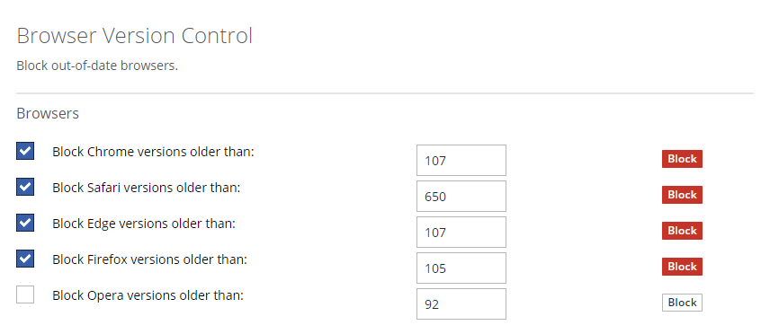

# Browser Version Control
This ruleset examines the `User-Agent` request header to determine the version of the client's browser and blocks out of date versions with a custom block page.  These browsers are supported in this current version of the ruleset:
- Google Chrome
- Apple Safari
- Microsoft Edge
- Mozilla Firefox
- Opera

The full browser version is detected (e.g. 107.0.1418.35) and presented in the block page.  However, for simplicity the policy will only block based on the major version (e.g. 107).

