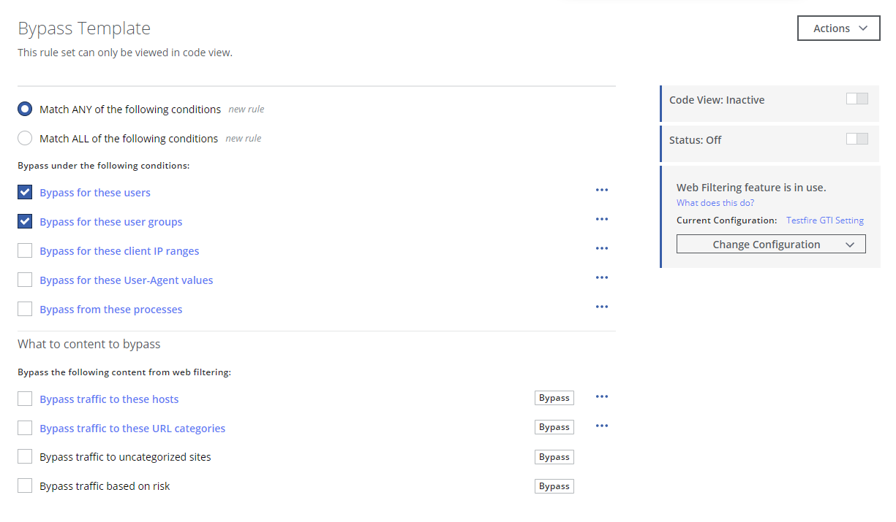

# Exclusion_Template
This ruleset doesn't address any particularly unique use case.  It is simply an alternate way to perform exclusions from certain web policies.  This was originally built to be a part of the `URL_Filtering` branch within the web policy.  However, it can be used in other branches provided the `END(URL_Filtering)` statement near the end has the argument replaced with the name of the intended parent (or grandparent or other ancestor) ruleset.

